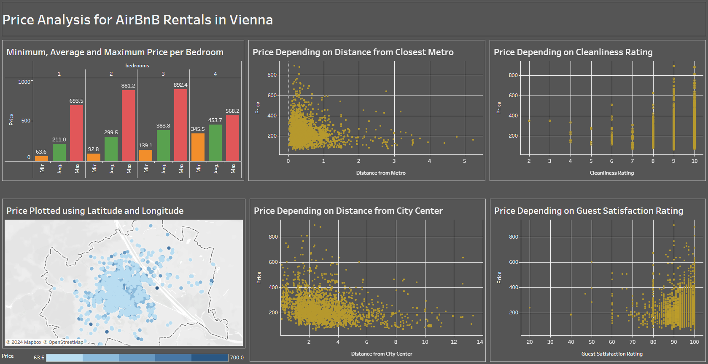

# Analysing AirBnB Prices in Vienna Tableau Dashboard

# Problem Statement

A property owner in Vienna is preparing to list their apartment on Airbnb and seeks to determine the optimal nightly price to maximize both occupancy rates and revenue. The ideal pricing should consider various factors, including:

Property characteristics: Room Type, whether the room is Shared or Private, Person Capacity, Bedrooms Count, and whether the Listing includes Multiple Rooms.
Host-specific factors: whether the Host is a Superhost and if the Listing is designed for Business travelers.
Location and accessibility: Distance to the City Center, Distance to the nearest Metro, Latitude, and Longitude.
Quality metrics: Cleanliness Rating and Overall Guest Satisfaction.
By analyzing these data points, the objective is to recommend a competitive, data-driven price for the Airbnb listing that aligns with local market conditions and maximizes booking potential.

# Dataset
Dataset was acquired from kaggle.com ([Available here](https://www.kaggle.com/datasets/thedevastator/airbnb-prices-in-european-cities))

- Dataset consists of data from several cities such as Amsterdam, Athens, Barcelona, Berlin, Budapest, Lisbon, London, Paris, Rome and Vienna
- Columns have data such as Id, Price, Room Type, Is Room Shared, Is Room Private, Person Capacity, Is Host Superhost, Is Listing Multiple Rooms, Is Listing for Business, Cleanliness Rating, Guest Satisfaction Overall, Bedrooms Count, Distance to City Center, Distance to Metro, Latitude, Longitude.

# Approach

- Data analysis using Tableau to give an overview of rental listings in Vienna to the property owner

# Results

- Minimum, average and maximum price based on room count gives a valuable insight on how to price the future booking
- Distance from metro does not impact the price range, although the expensive listings are always closer to metro
- If cleanliness rating is low (less than 5), then the listing price is lower than 500. If cleanliness is higher, the listing prices goes up to 800
- The listings plotted on a map using latitutde and longitude shows tha majorly the listings are located in city center with varied range of prices. 
- Distance from city center shows that in general the most expensive lsitings are clsoe to city center, although major listings are with lower price and clsoer to city center
- Guest Satisfaction reflects a similar relationship as the cleanliness score.

